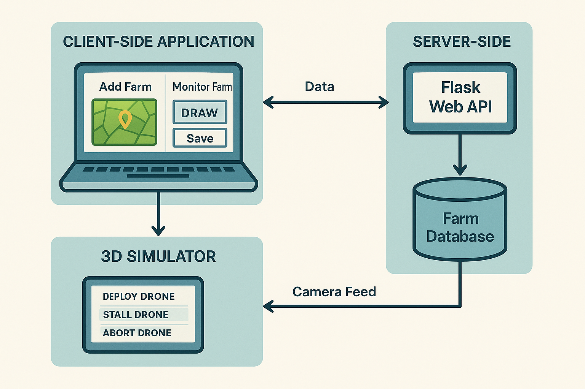

# Farm Drone Inspection System
# Farm Drone Inspection System

## 🎥 Simulation Demos
Check out the system in action:

| **Drone Deployment & Flight** | **AI Disease Detection View** |
|:-----------------------------:|:-----------------------------:|
| [](https://youtu.be/g9YbVTE68nQ) | [](https://youtube.com/shorts/sXDvJFSJuUQ?feature=share) |
| *Autonomous sweep pattern execution* | *Real-time YOLOn, GNN & SAM+LoRA* |


## Overview

The Farm Drone Inspection System is a comprehensive full-stack web application designed for autonomous agricultural drone management and monitoring. The system integrates a PyBullet-based physics simulation engine with a Flask RESTful API backend and a responsive web-based frontend interface. It enables users to define inspection zones, deploy autonomous drones, and monitor real-time mission progress through an intuitive web interface.

## System Architecture

### Technology Stack

- **Backend**: Python 3.8+, Flask 3.0.0, PyBullet 3.2.5
- **Frontend**: HTML5, CSS3, JavaScript (ES6+)
- **Physics Engine**: PyBullet with custom PID control implementation
- **Communication**: RESTful API with JSON payloads
- **Concurrency**: Multi-threaded simulation management

## Project Structure

```
Farm_drone_inspection_simulator/
├── backend/
│   ├── app.py                    # Flask API server
│   ├── drone_sweeper.py          # Simulation orchestration
│   ├── BaseControl.py            # Abstract control interface
│   ├── DSLPIDControl.py          # PID controller implementation
│   ├── enums.py                  # System enumerations
│   ├── cf2p.urdf                 # Crazyflie 2.0 model definition
│   └── ..............
│
├── frontend/
│   ├── index.html                # User interface markup
│   ├── style.css                 # Stylesheet definitions
│   └── script.js                 # Client-side application logic
│
├── requirements.txt          # Python dependencies
├── quick_setup.md
└── README.md                     # System documentation
```

## Features

### Farm Management
- Define inspection zones with configurable boundaries
- Visual representation of field parameters
- Persistent storage of farm configurations
- CRUD operations for farm entities

### Drone Operations
- Autonomous waypoint-based navigation
- Real-time position and telemetry tracking
- Mission pause/resume functionality
- Safe return-to-home abort protocol

### Monitoring and Control
- Real-time status updates via HTTP polling
- Live visualization of drone trajectory
- Mission progress tracking
- Comprehensive system logging

## System Requirements

### Hardware Requirements
- Processor: Multi-core CPU (2.0 GHz or higher)
- Memory: 4 GB RAM minimum (8 GB recommended)
- Graphics: OpenGL-compatible GPU for visualization
- Display: 1920x1080 resolution or higher

### Software Requirements
- Operating System: Linux, macOS, or Windows 10+
- Python: Version 3.8 or higher
- Web Browser: Chrome 90+, Firefox 88+, Safari 14+, or Edge 90+
- X Server: Required for GUI on Linux systems

## Installation Instructions

### 1. Repository Acquisition

Clone the repository to your local development environment:

```bash
git clone <repository-url>
cd Farm_drone_inspection_simulator
```

### 2. Dependency Installation

Open the directory and install required Python packages:

```bash
pip install -r requirements.txt
```

Alternatively, install dependencies individually:

```bash
pip install flask==3.0.0 flask-cors==4.0.0 pybullet==3.2.5 numpy==1.24.3 scipy==1.11.3 opencv-python==4.8.1.78 torch>=2.0.0 torchvision>=0.15.0 ultralytics>=8.0.0
```

### 3. Environment Configuration

Create a `requirements.txt` file in the backend directory with the following contents:

```
flask==3.0.0
flask-cors==4.0.0
pybullet==3.2.5
numpy==1.24.3
scipy==1.11.3
opencv-python==4.8.1.78

#AI
torch>=2.0.0
torchvision>=0.15.0
ultralytics>=8.0.0
```

### 4. File Structure Verification

Ensure all required files are present and properly located according to the project structure outlined above.

## Deployment Instructions

### Server Initialization

1. Navigate to the backend directory:
```bash
cd backend
```

2. Start the Flask application server:
```bash
python3 app.py
```

3. Verify server initialization:
```
Farm Drone Inspection Server Starting...
Server running on http://localhost:5000
```

### Client Access

Access the web interface by navigating to the following URL in a web browser:
```
http://localhost:5000
```

The frontend will establish a connection with the backend API automatically.

## Operation Manual

### Farm Configuration

#### Creating a Farm

1. Navigate to the "Add Farm" section in the client interface
2. Enter the following information:
   - **Farm Name**: Unique identifier for the inspection zone
   - **Location**: Geographical or organizational reference
3. Define field boundaries in meters:
   - **Minimum X**: Western boundary
   - **Minimum Y**: Southern boundary
   - **Maximum X**: Eastern boundary
   - **Maximum Y**: Northern boundary
4. Select the "DRAW" button to visualize the configured boundaries
5. Select the "SAVE" button to persist the farm configuration

**Example Configuration:**
```
Farm Name: Agricultural Zone Alpha
Location: Sector A-1
Boundaries: X[-5, 5], Y[-5, 5]
Field Size: 100 square meters
```

#### Managing Farms

- **Selection**: Click the "Select" button on a farm entry to designate it for drone deployment
- **Deletion**: Click the "Delete" button to remove a farm from the database
- **Viewing**: All configured farms are displayed in the "Monitor Farm" section

### Drone Deployment

#### Mission Initiation

1. Select a target farm from the "Monitor Farm" list
2. Click the "DEPLOY DRONE" button to initiate the mission
3. The PyBullet visualization window will open automatically
4. Monitor mission progress through the status panel

#### Mission Sequence

The autonomous mission follows this sequence:

1. **Vertical Takeoff**: Ascend to configured hover altitude
2. **Transit**: Navigate to field starting position
3. **Sweep Pattern**: Execute systematic lawn-mower coverage pattern
4. **Return**: Navigate back to home position (0, 0)
5. **Landing**: Controlled descent to ground level

### Mission Control

#### Pause Operation

- **Function**: "STALL DRONE" button
- **Behavior**: Suspends mission execution; drone maintains current position
- **Resume**: Click button again to continue mission

#### Abort Operation

- **Function**: "ABORT DRONE" button
- **Behavior**: Initiates safe return-to-home protocol
- **Sequence**:
  1. Cancel current waypoint navigation
  2. Ascend to hover altitude if below
  3. Navigate directly to home position
  4. Execute controlled landing
- **Status**: Mission marked as "ABORTED"

### System Monitoring

#### Status Indicators

- **Connection Status**: Indicates server connectivity
- **Drone Status**: Current operational state
  - IDLE: Ready for deployment
  - DEPLOYING: Mission initialization
  - FLYING: Active mission execution
  - STALLED: Mission paused
  - RETURNING_HOME: Abort sequence in progress
  - COMPLETED: Mission finished successfully
  - ABORTED: Mission terminated by operator

#### Telemetry Data

- **Position**: Real-time coordinates (X, Y, Z) in meters
- **Waypoint Progress**: Current waypoint / Total waypoints
- **Active Farm**: Currently deployed inspection zone
- **System Log**: Chronological event history with timestamps

## API Documentation

### Farm Management Endpoints

#### Retrieve All Farms

```http
GET /api/farms

Response 200 OK:
{
  "success": true,
  "farms": [
    {
      "id": 1,
      "name": "North Field",
      "location": "Sector A1",
      "boundaries": {
        "min_x": -2.0,
        "min_y": -2.0,
        "max_x": 2.0,
        "max_y": 2.0
      },
      "created_at": "2025-01-20 10:30:00"
    }
  ]
}
```

#### Create New Farm

```http
POST /api/farms
Content-Type: application/json

Request Body:
{
  "name": "South Field",
  "location": "Sector B2",
  "boundaries": {
    "min_x": -3.0,
    "min_y": -3.0,
    "max_x": 3.0,
    "max_y": 3.0
  }
}

Response 200 OK:
{
  "success": true,
  "message": "Farm added successfully",
  "farm": { ... }
}
```

#### Delete Farm

```http
DELETE /api/farms/{farm_id}

Response 200 OK:
{
  "success": true,
  "message": "Farm deleted successfully"
}
```

### Drone Control Endpoints

#### Retrieve Drone Status

```http
GET /api/drone/status

Response 200 OK:
{
  "success": true,
  "status": {
    "is_running": true,
    "is_paused": false,
    "position": [1.5, 2.3, 1.0],
    "current_waypoint": 5,
    "total_waypoints": 20,
    "status": "flying",
    "current_farm": {
      "id": 1,
      "name": "North Field"
    }
  }
}
```

#### Deploy Drone

```http
POST /api/drone/deploy
Content-Type: application/json

Request Body:
{
  "farm_id": 1
}

Response 200 OK:
{
  "success": true,
  "message": "Drone deployed successfully",
  "farm": { ... }
}
```

#### Toggle Mission Pause

```http
POST /api/drone/stall

Response 200 OK:
{
  "success": true,
  "message": "Drone stalled",
  "is_paused": true
}
```

#### Abort Mission

```http
POST /api/drone/abort

Response 200 OK:
{
  "success": true,
  "message": "Mission abort initiated"
}
```

## Configuration Parameters

### Simulation Settings

Located in `backend/app.py`:

```python
# Mission Parameters
HOVER_ALTITUDE = 1.0        # Cruise altitude in meters
SWEEP_STEP = 0.75           # Row spacing in meters
CRUISE_SPEED = 0.5          # Linear velocity in m/s
WAIT_TIME_AT_CORNER = 1.5   # Stabilization delay in seconds

# Physics Parameters
SIM_HZ = 240.0              # Simulation frequency in Hz
CTRL_HZ = 48.0              # Control update frequency in Hz
```

### Control Gains

Located in `backend/DSLPIDControl.py`:

```python
# Position Controller (Force)
P_COEFF_FOR = [0.4, 0.4, 1.25]      # Proportional gains [X, Y, Z]
I_COEFF_FOR = [0.05, 0.05, 0.05]    # Integral gains [X, Y, Z]
D_COEFF_FOR = [0.2, 0.2, 0.5]       # Derivative gains [X, Y, Z]

# Attitude Controller (Torque)
P_COEFF_TOR = [70000.0, 70000.0, 60000.0]  # Proportional [Roll, Pitch, Yaw]
I_COEFF_TOR = [0.0, 0.0, 500.0]            # Integral [Roll, Pitch, Yaw]
D_COEFF_TOR = [20000.0, 20000.0, 12000.0]  # Derivative [Roll, Pitch, Yaw]
```

### Frontend Settings

Located in `frontend/script.js`:

```javascript
// API Configuration
const API_BASE_URL = 'http://localhost:5000/api';

// Status Update Frequency
const POLL_INTERVAL = 500; // Milliseconds
```

## Troubleshooting

### Network Port Conflicts

**Issue**: Port 5000 is already in use

**Resolution**: Modify the port configuration in `backend/app.py`:

```python
app.run(debug=True, host='0.0.0.0', port=5001)
```

Update the API base URL in `frontend/script.js`:

```javascript
const API_BASE_URL = 'http://localhost:5001/api';
```

### Visualization Display Issues

**Issue**: PyBullet GUI window does not appear

**Resolution Options**:

1. Verify X server availability (Linux):
```bash
echo $DISPLAY
```

2. Enable headless mode in `backend/app.py`:
```python
p.connect(p.DIRECT)  # Replace p.GUI
```

3. Verify OpenGL support:
```bash
glxinfo | grep OpenGL
```

### API Connectivity Issues

**Issue**: Frontend displays "Disconnected" status

**Diagnostic Steps**:

1. Verify server operation:
```bash
curl http://localhost:5000/api/drone/status
```

2. Check browser console (F12) for error messages
3. Verify CORS configuration in `backend/app.py`
4. Disable browser extensions that may interfere with requests

### Dependency Resolution

**Issue**: Module import failures

**Resolution**:

```bash
cd backend
python3 -c "import flask, pybullet, numpy, scipy; print('Dependencies verified')"
```

If errors persist, reinstall dependencies:

```bash
pip install --upgrade --force-reinstall -r requirements.txt
```

### Control Stability Issues

**Issue**: Drone exhibits unstable flight behavior

**Resolution Steps**:

1. Reduce proportional gains in `DSLPIDControl.py`
2. Increase derivative gains for enhanced damping
3. Decrease `CRUISE_SPEED` parameter
4. Verify URDF model integrity (`cf2p.urdf`)

### Performance Optimization

**Issue**: Simulation exhibits reduced performance or crashes

**Resolution Options**:

1. Reduce simulation frequency: `SIM_HZ = 120.0`
2. Decrease environmental complexity: `num_bad_crops=5`
3. Close resource-intensive applications
4. Monitor system resources using system utilities

## System Architecture Diagram

The system follows a modular client-server architecture, separating the simulation logic from the user interface and AI processing.



```text
┌─────────────────────────────────────────────────────────────┐
│                    CLIENT (Web Browser)                     │
│  ┌──────────────────────┐      ┌──────────────────────┐   │
│  │   Presentation       │◄────►│   API Client         │   │
│  │   Layer              │      │   (HTTP/JSON)        │   │
│  │   (HTML/CSS/JS)      │      │   Polling: 500ms     │   │
│  └──────────────────────┘      └──────────┬───────────┘   │
└────────────────────────────────────────────┼───────────────┘
                                             │
                                             │ HTTP/JSON
                                             │
┌────────────────────────────────────────────┼───────────────┐
│                  SERVER (Flask)            │               │
│  ┌──────────────────────┐      ┌──────────▼───────────┐   │
│  │   Data Layer         │◄────►│   API Layer          │   │
│  │   (In-Memory DB)     │      │   (RESTful)          │   │
│  └──────────────────────┘      └──────────┬───────────┘   │
│                                            │               │
│  ┌─────────────────────────────────────────▼───────────┐   │
│  │         Business Logic Layer                        │   │
│  │         - Simulation Manager                        │   │
│  │         - Command Queue                             │   │
│  │         - State Management                          │   │
│  └─────────────────────────┬───────────────────────────┘   │
└────────────────────────────┼───────────────────────────────┘
                             │
                             │ Control Commands
                             │
┌────────────────────────────┼───────────────────────────────┐
│               SIMULATION ENGINE (PyBullet)  │               │
│  ┌──────────────────────┐      ┌───────────▼──────────┐   │
│  │   Physics Engine     │◄────►│   Control System     │   │
│  │   - Rigid Body       │      │   - PID Controller   │   │
│  │   - Collision        │      │   - Navigation       │   │
│  │   - Rendering        │      │   - State Estimator  │   │
│  └──────────────────────┘      └──────────────────────┘   │
└────────────────────────────────────────────────────────────┘
```

## Version Control Integration

### Initial Repository Setup

```bash
# Initialize repository
git init

# Add files to staging area
git add .

# Create initial commit
git commit -m "Initial commit: Farm Drone Inspection System"

# Add remote repository
git remote add origin <repository-url>

# Push to remote repository
git push -u origin main
```

### Standard Workflow

```bash
# Check repository status
git status

# Stage modified files
git add backend/app.py frontend/script.js

# Commit changes
git commit -m "Description of changes"

# Push to remote
git push origin main
```

## License

This software is provided for educational and research purposes.

## Contributing

Contributions should follow the established code style and include appropriate documentation. Submit pull requests with comprehensive descriptions of changes.

## Support

For technical issues:
1. Review troubleshooting documentation
2. Examine system logs in the web interface
3. Check backend terminal output for error messages
4. Verify all prerequisites are satisfied

## Authors

**[Sushant Sharma](https://github.com/sushantsharma13981)** — CAIR, IIT Mandi  
**[Aashish Negi](https://github.com/sushantsharma13981)** — CAIR, IIT Mandi  
**[Tanishq Khandelwal](https://github.com/Tanishq5003)** — CAIR, IIT Mandi  

## Acknowledgments

- PyBullet physics engine development team
- Flask framework contributors
- Crazyflie 2.0 platform designers
- **[Dr. Deepak Raina](https://github.com/deepakraina99)** — CAIR, IIT Mandi
